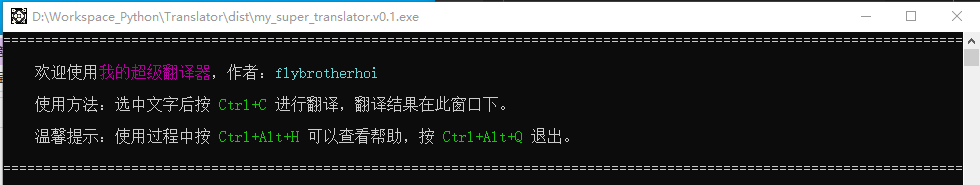
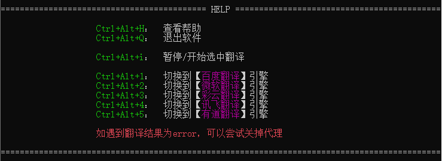
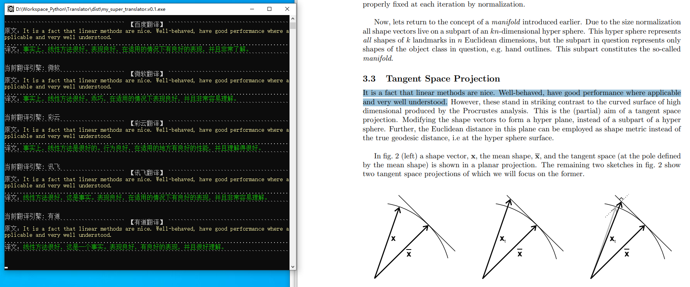

# 我的炒鸡翻译器


## 简介

这是一个聚合了多个翻译引擎的划词翻译器，主要是读论文时可以将英文翻译成中文。你需要自己准备各引擎的API key，并将其填入default.json中。

聚合引擎：
* 百度翻译：http://api.fanyi.baidu.com/api/trans/product/index/
* Microsoft翻译：https://portal.azure.com/
* 彩云小译：https://docs.caiyunapp.com/blog/2018/09/03/lingocloud-api/
* 讯飞翻译：https://www.xfyun.cn/doc/nlp/xftrans_new/API.html
* 有道翻译：https://ai.youdao.com/?keyfrom=fanyi-new-nav#/

优点：
* 仅在命令行下运行，不需要安装任何烦人的GUI库
* 体积很小，打包完只有7MB左右

## requirements
```bash
python>=3.6
colorama
fastlid
fasttext
pyinstaller
pynput
pyperclip
requests
```

## 1. 安装环境
```bash
pip install -r requirements.txt
```
## 2. 修改配置文件default.json，输入自己的apikey。

可以部分填入，只使用自己想要用的引擎。

```json
{
    "百度":{
        "appid":"-",
        "secretKey":"-"
    },
    "彩云":{
        "token":"-"
    },
    "微软":{
        "key" : "-",
        "location" : "-"
    },
    "讯飞":{
        "APPId":"-",
        "APISecret":"-",
        "APIKey":"-"
    },
    "有道":{
        "APPId":"-",
        "APPSecret":"-"
    }
}    
```

## 3.运行
### 3.1 开始
```bash
python launch_translator.py
```


### 3.2 按下Ctrl+Alt+H查看帮助


### 3.3 选中文字后按下Ctrl+C，显示翻译结果


### 3.4 按下Ctrl+Alt+Q退出


## 4.[可选]打包为exe
打包为exe后可以更方便地运行，实测打包后也只有7MB左右，十分推荐。
```bash
./to_exe.bat
```
打包结果在dist文件夹下，双击exe文件即可运行，操作方式与第3小节一致。

注意运行时要把default.json放在.exe文件的同目录下